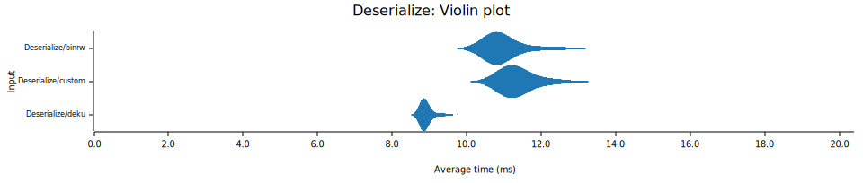

# Deku Benchmark
This currently tracks the benchmark of the deku branch [impl-writer-inline-1fa84fc](https://github.com/sharksforarms/deku/tree/impl-writer-inline-read-bytes).

# Results
```
$ cargo +stable bench --profile perf
```




# Benchmark details

<details><summary>rust version</summary>

```
$ cargo +stable --version
cargo 1.73.0 (9c4383fb5 2023-08-26)
```

</details>

<details><summary>lscpu</summary>

```
$ lscpu
Architecture:            x86_64
  CPU op-mode(s):        32-bit, 64-bit
  Address sizes:         39 bits physical, 48 bits virtual
  Byte Order:            Little Endian
CPU(s):                  4
  On-line CPU(s) list:   0-3
Vendor ID:               GenuineIntel
  Model name:            Intel(R) Core(TM) i5-6300U CPU @ 2.40GHz
    CPU family:          6
    Model:               78
    Thread(s) per core:  2
    Core(s) per socket:  2
    Socket(s):           1
    Stepping:            3
    CPU(s) scaling MHz:  80%
    CPU max MHz:         3000.0000
    CPU min MHz:         400.0000
    BogoMIPS:            5001.23
```

</details>