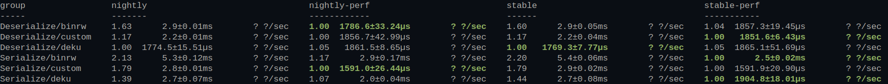

# Deku Benchmark

> [!WARNING]
> This only touches the surface of comparison of `deku`, `binrw`, and `custom` and only tests
  basic struct byte only reading.

> [!WARNING]
> These are my own benchmarks, and haven't been confirmed for validity.

| Crate   | Version    | Features |
| --------| -----------| -------- |
| `deku`  | `^0.18.0`  | `deafult-features = false, features = ["std"]`    |
| `birnw` | `^0.14.0`  |          |

## My Hardware Nightly Compare
`$ ./run.bench`

- nightly rust version: See `rust-toolchain.toml`


<details><summary>lscpu</summary>

```
Architecture:             x86_64
  CPU op-mode(s):         32-bit, 64-bit
  Address sizes:          39 bits physical, 48 bits virtual
  Byte Order:             Little Endian
CPU(s):                   8
  On-line CPU(s) list:    0-7
Vendor ID:                GenuineIntel
  Model name:             Intel(R) Core(TM) i7-7700K CPU @ 4.20GHz
    CPU family:           6
    Model:                158
    Thread(s) per core:   2
    Core(s) per socket:   4
    Socket(s):            1
    Stepping:             9
    CPU(s) scaling MHz:   78%
    CPU max MHz:          4500.0000
    CPU min MHz:          800.0000
    BogoMIPS:             8403.00
    Flags:                fpu vme de pse tsc msr pae mce cx8 apic sep mtrr pge mca cmov pat pse36 clflush dts acpi mmx fxsr sse sse2 ss ht tm pbe syscall nx pdpe1gb rdtscp lm cons
                          tant_tsc art arch_perfmon pebs bts rep_good nopl xtopology nonstop_tsc cpuid aperfmperf pni pclmulqdq dtes64 monitor ds_cpl vmx est tm2 ssse3 sdbg fma cx
                          16 xtpr pdcm pcid sse4_1 sse4_2 x2apic movbe popcnt tsc_deadline_timer aes xsave avx f16c rdrand lahf_lm abm 3dnowprefetch cpuid_fault pti ssbd ibrs ibpb
                           stibp tpr_shadow flexpriority ept vpid ept_ad fsgsbase tsc_adjust bmi1 avx2 smep bmi2 erms invpcid mpx rdseed adx smap clflushopt intel_pt xsaveopt xsav
                          ec xgetbv1 xsaves dtherm ida arat pln pts hwp hwp_notify hwp_act_window hwp_epp vnmi md_clear flush_l1d arch_capabilities
Virtualization features:
  Virtualization:         VT-x
Caches (sum of all):
  L1d:                    128 KiB (4 instances)
  L1i:                    128 KiB (4 instances)
  L2:                     1 MiB (4 instances)
  L3:                     8 MiB (1 instance)
NUMA:
  NUMA node(s):           1
  NUMA node0 CPU(s):      0-7
```

</details>

## Perf Reports In CI

> [!WARNING]
> I don't control the hardware these run on.

### `cargo +stable bench --profile=perf`
- [Full Results](https://wcampbell0x2a.github.io/deku-bench/perf/report/index.html)

### `cargo +stable bench --release`
- [Full Results](https://wcampbell0x2a.github.io/deku-bench/release/report/index.html)

